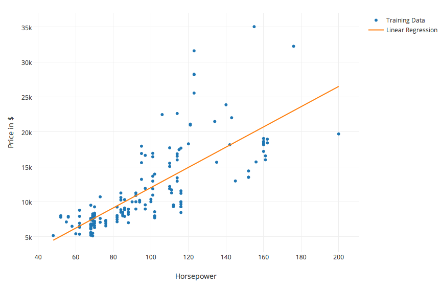
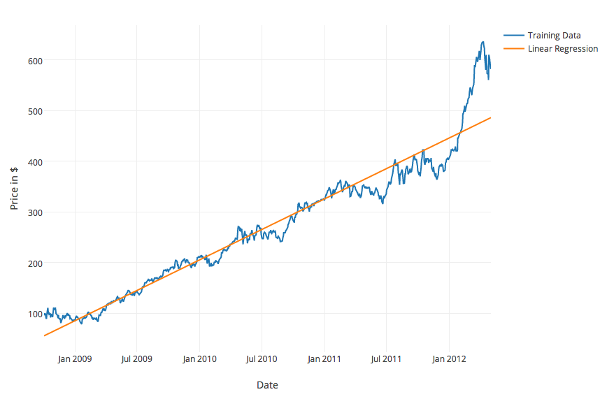
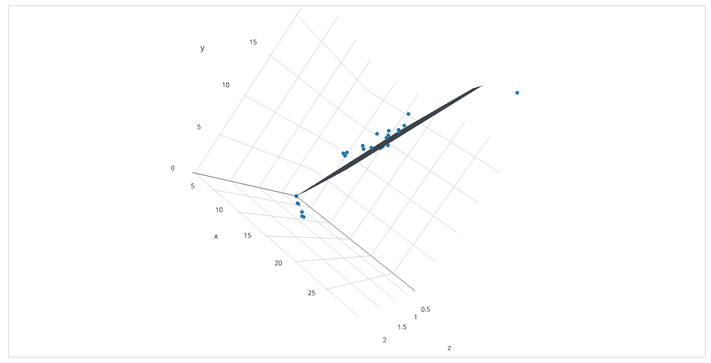
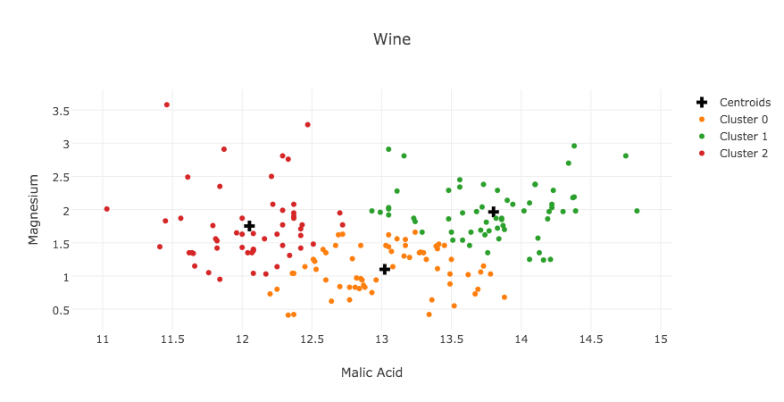

# shaman

Machine Learning library for node.js

## Linear Regression

shaman supports [both simple linear regression  and multiple linear
regression](http://en.wikipedia.org/wiki/Linear_regression#Simple_and_multiple_regression).

It supports two different algorithms to train the model:

0. [The Normal Equation](http://en.wikipedia.org/wiki/Linear_least_squares_(mathematics))
1. [The Gradient Descent Algorithm](http://en.wikipedia.org/wiki/Gradient_descent)

### Usage

By default, shaman uses the Normal Equation for linear regression.

```javascript
var X = [1, 2, 3, 4, 5];
var Y = [2, 2, 3, 3, 5];
var lr = new LinearRegression(X,Y);
lr.train(function(err) {
  if (err) { throw err; }
  
  // you can now start using lr.predict:
  console.log(lr.predict(1));
});
```

If your data does not work well with the Normal Equation, you can also
use the Gradient Descent algorithm as an alternative.

```javascript
var X = [1, 2, 3, 4, 5];
var Y = [2, 2, 3, 3, 5];
var lr = new LinearRegression(X,Y, {
  algorithm: 'GradientDescent'
});
lr.train(function(err) {
  if (err) { throw err; }
  
  // you can now start using lr.predict:
  console.log(lr.predict(1));
});
```

When using Gradient Descent, you can define the number of iterations
(numberOfIterations and the learning rate (learningRate) as options to
the LinearRegression function.


```javascript
var lr = new LinearRegression(X,Y, {
  algorithm: 'GradientDescent',
  numberOfIterations: 1000, // defaults to 8500
  learningRate: 0.5 // defaults to 0.1
});
```

When using the Gradient Descent algorithm, you can ask shaman to save
the results of the cost function at each iteration of the algorithm.
This can be useful if you would like to plot the cost function to ensure
that it is converging.

```javascript
var lr = new LinearRegression(X,Y, {
  algorithm: 'GradientDescent',
  saveCosts: true // defaults to false
});
lr.train(function(err) {
  // you can now get they array of costs:
  console.log(lr.costs);
});
```

If you are troubleshooting, you can pass in a debug option (set to
true). Shaman will then debug useful info in the console (such as the
cost at every iteration of the Gradient Descent algorithem).

```javascript
var lr = new LinearRegression(X,Y, {
  algorithm: 'GradientDescent',
  debug: true // defaults to false
});
lr.train(function(err) {
  // will console.log some useful info
});
```

### Examples


#### Simple Linear Regression - Cars

[Below](https://plot.ly/~luccastera/2) to see an example of Simple Linear Regression
using the Normal Equation to evaluate the price of cars based on their horsepower that was done with the shaman
library. Code is in [examples/cars.js](examples/cars.js)).



#### Simple Linear Regression - AAPL Stock Price

[Below](https://plot.ly/~luccastera/3/aapl-stock-prices/) to see an
example of Simple Linear Regression applies to the stock price of AAPL
using the Gradient Descent algorithm from 2008 to 2012. Code can be seen at
[examples/stock.js](examples/stock.js).



#### Multiple Linear Regression - Cigarettes

[Below](https://plot.ly/~luccastera/4/cigarettes/) to see an
example of Multiple Linear Regression to evaluate Carbon Monoxide in
cigarettes from nicotine and tar content. Code can be seen at
[examples/cigarettes.js](examples/cigarettes.js).



## Clustering (k-means)

shaman implements the k-means clustering algorithm.

### Usage

```javascript
var KMeans = require('shaman').KMeans;

var kmeans = new KMeans(K);

kmeans.cluster(data, function(err, clusters, centroids) {
  if (err) { throw err; }

  console.log(clusters);
});

```

### Example: clustering wines

[Below](https://plot.ly/~luccastera/20/wine/) to see an example of
clustering using the k-means algorithm on [the wine dataset from
UCI](http://archive.ics.uci.edu/ml/datasets/Wine).

The code is located at [examples/wine.js](examples/wine.js).



## License

[MIT](LICENSE)
